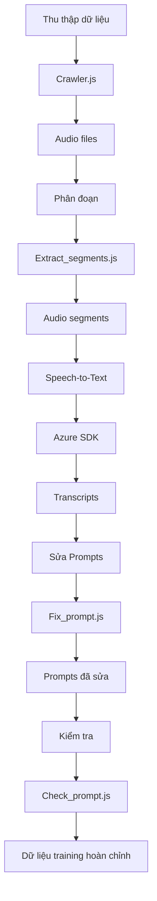

# 🎵 Vietnamese Audio Crawler for AI Training

## Công cụ tự động thu thập và xử lý dữ liệu audio tiếng Việt cho huấn luyện AI

Hệ thống crawler đa danh mục tin tức Việt Nam với phân đoạn giọng nói và pipeline xử lý dữ liệu hoàn chỉnh cho các mô hình AI/ML.

## 📁 Cấu trúc Project

```text
tool_create_prompt_trainning_AI/
├── crawler_auto_download_audio/     # 🕷️ Core processing modules
│   ├── crawler.js                   # Main multi-category audio crawler
│   ├── extract_random_segments.js   # Audio segmentation tool
│   ├── azure_speech_sdk.js          # Azure Speech-to-Text processor
│   ├── automata_dfa_match_v2.js     # Advanced text matching algorithm
│   ├── fix_prompt_file_V2.js        # Prompt correction & validation
│   ├── check_prompt.js              # Prompt matching verification
│   ├── package.json                 # Dependencies & scripts
│   └── .env                         # Azure Speech API credentials
├── dantri_audios/                   # 📥 Downloaded audio files
│   ├── xa-hoi/                      # Social news category
│   ├── kinh-doanh/                  # Business news category
│   ├── giai-tri/                    # Entertainment news category
│   ├── suc-khoe/                    # Health news category
│   ├── cong-nghe/                   # Technology news category
│   └── the-thao/                    # Sports news category
├── dantri_segments/                 # ✂️ Segmented training data
│   ├── 3s/                          # 3-second segments
│   ├── 5s/                          # 5-second segments
│   ├── 7s/                          # 7-second segments
│   ├── 10s/                         # 10-second segments
│   ├── others/                      # Other duration segments
│   └── reports/                     # Processing reports
├── prompt_V2.txt                    # 📝 Original prompts file
├── prompt_fixed_V2.txt              # ✅ Corrected prompts file
├── fix_prompt_log_V2.txt            # 📊 Prompt correction log
└── check_prompt_matching_log.txt    # 🔍 Prompt verification log
```

## 🚀 Tính năng chính

### ✅ Thu thập dữ liệu

- **Đa danh mục**: 6 chuyên mục tin tức Việt Nam (xã hội, kinh doanh, giải trí, sức khỏe, công nghệ, thể thao)
- **Đa giọng đọc**: 3 vùng miền (Bắc, Trung, Nam) cho mỗi bài viết
- **Tự động hóa**: Crawl hàng loạt bài viết từ Dân trí
- **Chống block**: Headers và timing thông minh

### ✅ Xử lý Audio

- **Chuyển đổi định dạng**: MP3 → WAV (PCM16 16kHz mono)
- **Phân đoạn thông minh**: Chia thành segments 3s, 5s, 7s, 10s
- **Đặt tên chuẩn**: Format `category_articleId_voice_segXXX_duration.wav`

### ✅ Speech-to-Text

- **Azure Cognitive Services**: Độ chính xác cao cho tiếng Việt
- **Batch processing**: Xử lý hàng loạt file audio
- **Lưu transcript**: Tự động tạo file transcript cho mỗi bài

### ✅ Sửa lỗi Prompt

- **Thuật toán DFA**: Matching thông minh với dấu tiếng Việt
- **Tự động sửa**: Sửa lỗi chính tả, định dạng
- **Kiểm tra chất lượng**: Verify 100% prompts đã sửa

### ✅ Công cụ quản lý

- **Progress tracking**: Báo cáo tiến độ chi tiết
- **Error handling**: Xử lý lỗi graceful
- **Modular design**: Code dễ mở rộng và bảo trì

## 📋 Yêu cầu hệ thống

- **Node.js**: v16+ (khuyến nghị v18+)
- **FFmpeg**: Cần thiết cho chuyển đổi audio
- **Azure Speech**: API key và region (East Asia)
- **RAM**: 4GB+ (cho xử lý audio lớn)
- **Disk**: 10GB+ free space

## ⚡ Cài đặt nhanh

### 1. Clone và cài đặt

```bash
git clone <repository-url>
cd tool_create_prompt_trainning_AI/craw_auto_download_audio
npm install
```

### 2. Cấu hình Azure Speech API

```bash
# Tạo file .env trong crawler_auto_download_audio/
echo "AZURE_SPEECH_KEY=your_azure_speech_key_here" > crawler_auto_download_audio/.env
echo "AZURE_SPEECH_REGION=eastasia" >> crawler_auto_download_audio/.env
```

### 3. Cài đặt FFmpeg

```bash
# Windows (Chocolatey)
choco install ffmpeg
# Ubuntu/Debian
sudo apt install ffmpeg
# macOS
brew install ffmpeg
```

## 🎯 Hướng dẫn sử dụng

### Bước 1: Thu thập dữ liệu audio

```bash
# Thu thập audio từ các danh mục tin tức
npm run crawl
```

- Crawl 10-20 bài viết mỗi danh mục
- Tải 3 giọng đọc cho mỗi bài
- Lưu vào `dantri_audios/`

### Bước 2: Phân đoạn audio

```bash
# Chia audio thành segments cho training
npm run segment
```

- Chia thành segments: 3s, 5s, 7s, 10s
- Tạo báo cáo tiến độ tự động
- Lưu vào `dantri_segments/`

### Bước 3: Speech-to-Text (Tùy chọn)

```bash
# Chuyển đổi audio thành text
npm run stt
```

- Sử dụng Azure Speech API
- Tạo file transcript cho mỗi audio
- Lưu vào thư mục tương ứng

### Bước 4: Sửa lỗi Prompts

```bash
# Sửa lỗi và validate prompts
npm run prompt
```

- Sử dụng thuật toán DFA matching
- Sửa lỗi chính tả, format
- Tạo file `prompt_fixed_V2.txt`

### Bước 5: Kiểm tra chất lượng

```bash
# Verify prompts đã sửa
npm run cp
```

- Kiểm tra 100% prompts match với transcript
- Tạo báo cáo chi tiết
- Lưu log vào `check_prompt_matching_log.txt`

## 📊 Scripts có sẵn

| Script            | Lệnh                              | Mô tả                     |
| ----------------- | --------------------------------- | ------------------------- |
| `npm run crawl`   | `node crawler.js`                 | Thu thập audio từ Dân trí |
| `npm run segment` | `node extract_random_segments.js` | Phân đoạn audio           |
| `npm run stt`     | `node azure_speech_sdk.js`        | Speech-to-Text            |
| `npm run prompt`  | `node fix_prompt_file_V2.js`      | Sửa lỗi prompts           |
| `npm run cp`      | `node check_prompt.js`            | Kiểm tra prompts          |

### 🔧 Scripts bổ sung

```bash
# Code quality
npm run lint          # Check linting
npm run lint:fix      # Fix linting issues
npm run format        # Format code
# Development
npm run dev           # Development mode with nodemon
```

## ⚙️ Cấu hình nâng cao

### crawler.js - Cấu hình crawler

```javascript
const CONFIG = {
  MIN_AUDIO_PER_CATEGORY: 10, // Số audio tối thiểu mỗi danh mục
  MAX_AUDIO_PER_CATEGORY: 20, // Số audio tối đa mỗi danh mục
  MAX_ARTICLES_TO_CHECK: 30, // Số bài viết kiểm tra mỗi danh mục
  DELAY_BETWEEN_ARTICLES: 500, // Delay giữa các bài (ms)
  DELAY_BETWEEN_CATEGORIES: 2000, // Delay giữa các danh mục (ms)
  DELAY_BETWEEN_VOICES: 200, // Delay giữa các giọng (ms)
  REQUEST_TIMEOUT: 10000, // Timeout request (ms)
};
```

### extract_random_segments.js - Cấu hình segmentation

```javascript
const SEGMENT_LENGTHS = [3, 5, 7, 10]; // Độ dài segments (giây)
```

### fix_prompt_file_V2.js - Cấu hình prompt fixing

```javascript
const result = autoMataCorrect(prompt, cleanTranscript, {
  acceptThreshold: 0.8, // Ngưỡng chấp nhận (0-1)
  maxSkip: 2, // Số từ bỏ qua tối đa
  weights: {
    // Trọng số vị trí
    start: 0.35,
    middle: 0.3,
    end: 0.35,
  },
});
```

## 📈 Workflow hoàn chỉnh



## 📊 Định dạng Output

### Audio Files (`dantri_audios/`)

```text
xa-hoi/
└── 20250829101215122/           # Article ID
    ├── 20250829101215122__1.wav # North voice
    ├── 20250829101215122__2.wav # Central voice
    └── 20250829101215122__3.wav # South voice
```

### Audio Segments (`dantri_segments/`)

```text
3s/
├── xa-hoi_20250829101215122_1_seg001_3s.wav
├── xa-hoi_20250829101215122_1_seg002_3s.wav
└── ...
5s/
├── xa-hoi_20250829101215122_1_seg001_5s.wav
└── ...
reports/
└── segmentation_report_20250829.json
```

### Prompt Files

- `prompt_V2.txt`: Prompts gốc
- `prompt_fixed_V2.txt`: Prompts đã sửa
- `fix_prompt_log_V2.txt`: Log chi tiết sửa đổi
- `check_prompt_matching_log.txt`: Báo cáo kiểm tra

## 🔍 Monitoring & Logs

### Progress Reports

- **Segmentation**: `dantri_segments/reports/segmentation_report_YYYYMMDD.json`
- **Prompt fixing**: `fix_prompt_log_V2.txt`
- **Verification**: `check_prompt_matching_log.txt`

### Sample Progress Report

```json
{
  "status": "completed",
  "timestamp": "20250829",
  "duration_minutes": 15,
  "summary": {
    "total_audio_files": 180,
    "processed_files": 180,
    "total_segments_created": 5432
  },
  "segment_distribution": {
    "3s": 2345,
    "5s": 1890,
    "7s": 900,
    "10s": 400,
    "others": 897
  }
}
```

## 🛠️ Troubleshooting

### Lỗi thường gặp

#### 1. Azure Speech API

```bash
# Kiểm tra API key
node crawler_auto_download_audio/azure_speech_sdk.js
```

#### 2. FFmpeg not found

```bash
# Kiểm tra FFmpeg
ffmpeg -version
# Cài đặt FFmpeg
# Windows: choco install ffmpeg
# Ubuntu: sudo apt install ffmpeg
# macOS: brew install ffmpeg
```

#### 3. Network timeout

- Tăng `REQUEST_TIMEOUT` trong `crawler.js`
- Giảm số lượng concurrent requests
- Thêm delay giữa requests

#### 4. Disk space

- Xóa files không cần thiết
- Chỉ giữ lại segments cần thiết
- Sử dụng external storage

### Performance Tips

- **Batch processing**: Xử lý theo batches nhỏ
- **Memory management**: Restart process định kỳ
- **Parallel processing**: Chạy multiple instances
- **Caching**: Sử dụng cache cho repeated operations

## 📚 API Reference

### Azure Speech SDK

- **Service**: Azure Cognitive Services
- **Region**: East Asia
- **Language**: vi-VN
- **Format**: WAV PCM16 16kHz mono

### Dependencies

```json
{
  "axios": "^1.11.0", // HTTP client
  "cheerio": "^1.1.2", // HTML parser
  "microsoft-cognitiveservices-speech-sdk": "^1.45.0",
  "fuse.js": "^7.1.0", // Fuzzy search
  "string-similarity": "^4.0.4" // Text similarity
}
```

## 🤝 Contributing

1. Fork repository
2. Tạo feature branch (`git checkout -b feature/AmazingFeature`)
3. Commit changes (`git commit -m 'Add AmazingFeature'`)
4. Push to branch (`git push origin feature/AmazingFeature`)
5. Tạo Pull Request

## 📄 License

ISC License - Xem file `LICENSE` để biết thêm chi tiết.

## 👥 Tác giả

**dattq2002** - _Initial work_

## 🙏 Acknowledgments

- **Dân trí** - Nguồn dữ liệu tin tức
- **Azure Cognitive Services** - Speech-to-Text API
- **FFmpeg** - Audio processing
- **Open source community** - Libraries và tools

---

**🎯 Sẵn sàng tạo dữ liệu training cho AI tiếng Việt!**
